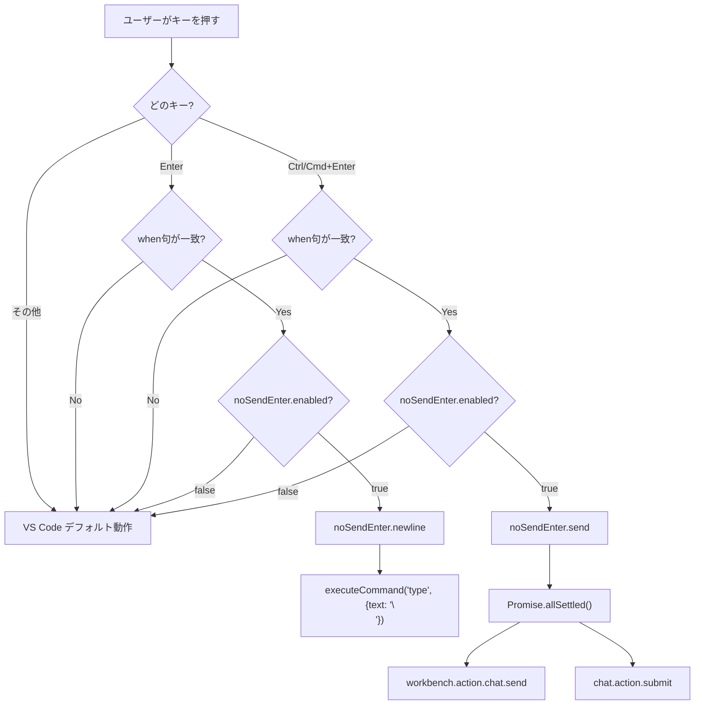
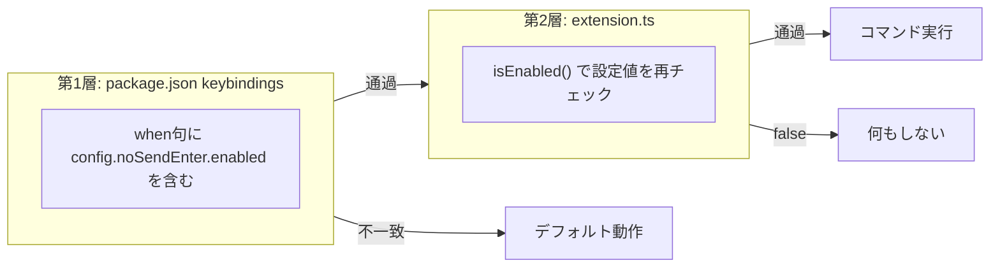
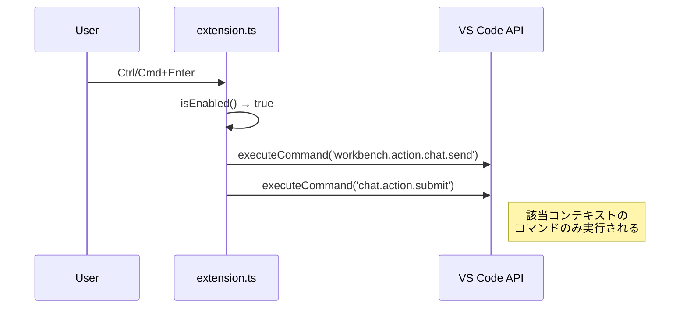

# Architecture

## ファイル構成

```
no-send-enter/
├── package.json          # 拡張マニフェスト（コマンド・キーバインド・設定の宣言）
├── tsconfig.json         # TypeScript設定
├── jest.config.js        # Jestテスト設定
├── src/
│   ├── extension.ts      # 拡張エントリーポイント（28行）
│   ├── extension.test.ts # テスト（13ケース）
│   └── __mocks__/
│       └── vscode.ts     # vscodeモジュールのモック
└── out/                  # コンパイル済みJS（gitignore対象）
```

## キーバインド処理フロー



## 二層の有効/無効チェック



- **第1層（宣言的）**: `package.json` の when 句で `config.noSendEnter.enabled` を条件指定。無効時はキーバインド自体が発火しない。
- **第2層（命令的）**: `extension.ts` 内の `isEnabled()` で動的に設定値を再チェック。安全ネットとして機能。

## 送信コマンドの解決

`noSendEnter.send` は複数のチャット実装に対応するため、`Promise.allSettled` で既知の送信コマンドを同時に発火する。対象コンテキストでないコマンドは no-op となる。



## when句コンテキスト対応表

| コンテキスト | 対象ツール | Enter → newline | Ctrl/Cmd+Enter → send |
|---|---|---|---|
| `inChatInput` | Copilot Chat | ✓ | ✓ |
| `interactiveEditorFocused` | インラインチャット | ✓ | ✓ |
| `cursorChatFocus` | Cursor AI Chat | ✓ | ✓ |
| `webviewFocus` | Antigravity等 | ✓ | ✓ |

## テスト戦略

- `vscode` モジュールを `src/__mocks__/vscode.ts` でモック
- Jest の `moduleNameMapper` でインポートを差し替え
- コマンド登録・呼び出し・設定チェックを単体テストでカバー（カバレッジ100%）
